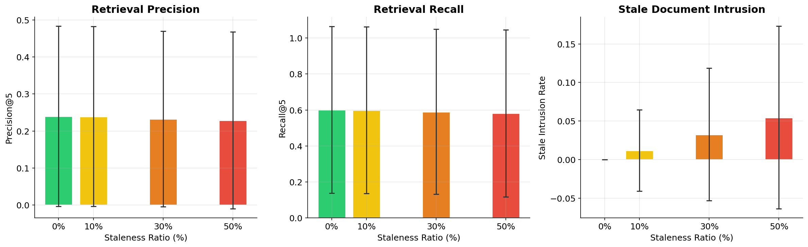
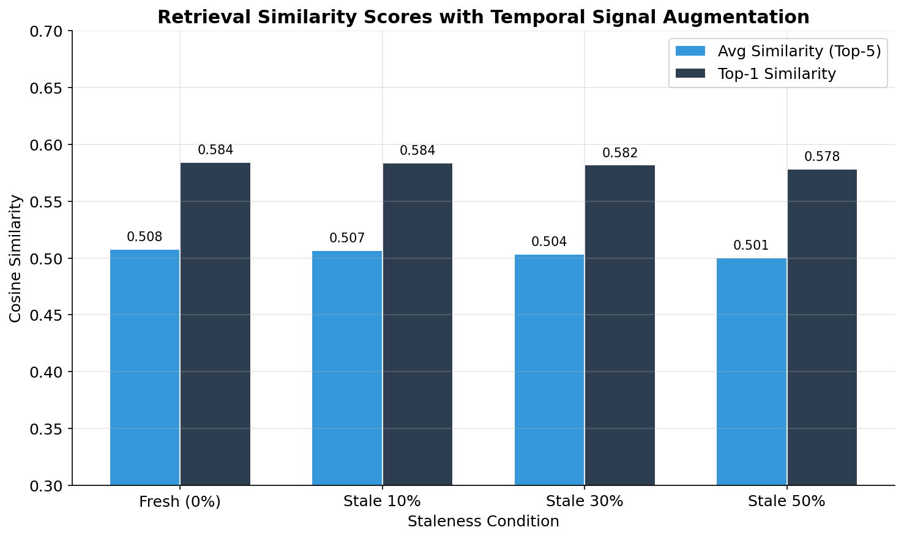
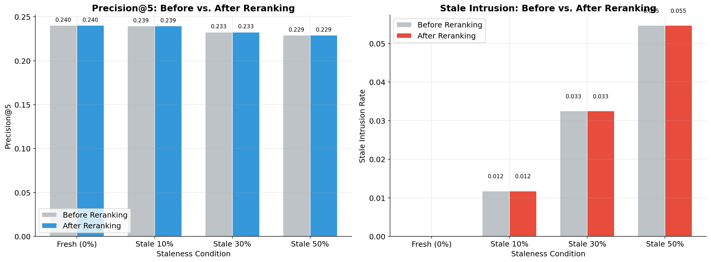
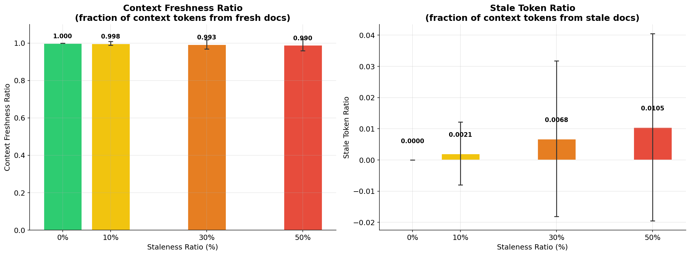
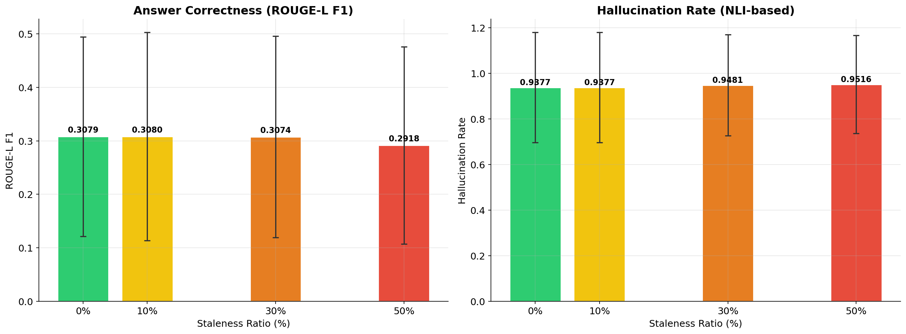
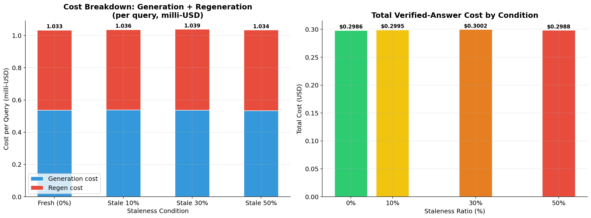

# FreshRAG (Temporal-Aware): Mitigating Stale Content in RAG Pipelines

This repository contains the code and data for **FreshRAG**, a research project that (1) measures how outdated ("stale") content silently degrades Retrieval-Augmented Generation (RAG) pipelines, and (2) proposes a lightweight **temporal-aware mitigation** that injects a freshness signal into every pipeline stage. We compare the temporal-aware pipeline against a baseline across four staleness levels (0%, 10%, 30%, 50%) on five enterprise domains and five pipeline stages: retrieval, reranking, context assembly, generation, and verification.

## Key Takeaways

- **A single scalar freshness signal (α) neutralises most upstream damage.** Stale intrusion at 50% staleness drops from **15.4% → 5.5%** (−64%) with α = 0.2 added as an extra embedding/score dimension.
- **Context contamination is nearly eliminated.** Stale token ratio in the LLM prompt falls from **17.0% → 1.05%** (−94%); context freshness rises from 83.0% → 98.9%.
- **The reranker stops promoting stale docs.** The temporal-aware cross-encoder now produces a negative mean rank shift across all staleness levels — fresh documents are consistently promoted, stale ones demoted.
- **Generation quality remains bottlenecked.** Despite clean contexts, answer correctness (~0.30 ROUGE-L) and hallucination rates (~95%) are nearly identical to baseline — the LLM is a systemic ceiling, not the stale data.
- **Verification cost drops by ~32%** per query (\$0.00153 → \$0.00103) under temporal mitigation, because regeneration cost falls as upstream contradictions shrink.

---

## Design of the Temporal-Aware Pipeline

The baseline pipeline is purely content-based: embeddings, cross-encoder scores, and NLI verdicts have no notion of document age. The temporal variant injects a single scalar freshness signal `α` (default **0.2**) at each stage, without retraining any model.

| Stage | Baseline | Temporal-Aware Modification |
|---|---|---|
| **Retrieval** | FAISS IndexFlatIP over D-dim sentence embeddings | Each doc embedding is extended by one dimension: **+α** if fresh, **−α** if stale. The query gets **+α** (prefers fresh). Similarity becomes `cos(q,d) + α·sign(fresh(d))·α / (D+1)`. |
| **Reranking** | Cross-encoder re-scores retrieved docs | Cross-encoder score + **α** bonus for fresh docs, **−α** penalty for stale docs, then re-sort. |
| **Context Assembly** | Top-k retrieved chunks assembled into the prompt | Fallback pool prioritises fresh docs when NLI filters chunks; stale chunks are down-weighted in ordering. |
| **Generation** | Prompt asks the LLM to answer from context | Prompt additionally instructs the model to *prioritise the most current content and be cautious of potentially outdated information*. |
| **Verification** | NLI-based entailment check, regenerate on failure | Inherits cleaner upstream context; no α applied directly, but benefits from reduced contradictions. |

Design choice: `α` is a single knob, applied uniformly across all stages, with no per-domain tuning. This keeps the mitigation transparent and cheap to deploy.

### Data

We build on the [RAGBench](https://huggingface.co/datasets/rungalileo/ragbench) dataset, sampling 289 queries across five enterprise domains (CovidQA, CUAD, ExpertQA, FinQA, TechQA), balanced between **time-sensitive** and **time-insensitive** queries. The corpus contains ~997 documents with ground-truth relevance labels. Stale variants are Gemini-generated: semantically similar to the original but factually outdated. Four conditions are evaluated: Fresh (0%), Stale 10%, Stale 30%, Stale 50%.

### Models

| Purpose | Model |
|---|---|
| Embedding | `all-MiniLM-L6-v2` |
| Retrieval | FAISS IndexFlatIP (+1 temporal dim) |
| Reranking | `cross-encoder/ms-marco-MiniLM-L6-v2` (+α bonus) |
| NLI (assembly) | `cross-encoder/nli-MiniLM2-L6-H768` |
| NLI (verification) | `cross-encoder/nli-deberta-v3-base` |
| Generation | Gemini 2.5 Flash (temporal-aware prompt) |

### Pipeline Architecture

```
Corpus Building → Stale Preparation → Retrieval(+α) → Reranking(+α) → Context Assembly(+α) → Generation(prompt) → Verification
   (Stage 1)        (Stage 2)          (Stage 3)       (Stage 3b)         (Stage 3c)           (Stage 4)          (Stage 5)
```

---

## How to Run

```bash
pip install sentence-transformers faiss-cpu numpy pandas matplotlib google-generativeai datasets requests tqdm
export GOOGLE_API_KEY="your-key-here"
```

All scripts run from the **repository root**. Each stage consumes the previous stage's output. The temporal pipeline writes to `freshrag_experiment/results_temporal/` and figures to `figures_temporal/`.

```bash
# Stage 1: Build corpus from RAGBench
jupyter notebook notebooks/ragbench.ipynb

# Stage 2: Generate stale corpus conditions
python scripts/stale_pipeline.py --step all

# Stage 3: Temporal retrieval (embedding + freshness dimension)
python scripts/retrieval_temporal_eval.py --corpus_dir ./freshrag_experiment --k 5 --alpha 0.2

# Stage 3b: Temporal reranking (+α/−α on cross-encoder scores)
python scripts/rerank_temporal_eval.py --corpus_dir ./freshrag_experiment --k 5 --alpha 0.2

# Stage 3c: Temporal context assembly (fresh-first fallback pool)
python scripts/context_assembly_temporal_eval.py --corpus_dir ./freshrag_experiment --k 5 --alpha 0.2

# Stage 4: Temporal generation (prompt instructs model to prefer current info)
python scripts/generation_temporal_eval.py --corpus_dir ./freshrag_experiment --model gemini-2.5-flash

# Stage 5: Temporal verification
python scripts/verification_temporal_eval.py --corpus_dir ./freshrag_experiment --max_regen_attempts 1
```

Baseline counterparts (`retrieval_eval.py`, `rerank_eval.py`, ...) produce comparable numbers in `results/` using the same architecture minus the α signal.

### Analysis Notebooks

Run `notebooks/*_analysis_temporal.ipynb` after each stage to regenerate figures and summary tables in `figures_temporal/` and `results/*_temporal_summary_table.csv`.

---

## Results and Findings (Temporal-Aware vs. Baseline)

### Stage 3 — Retrieval

| Condition | Precision@5 | Recall@5 | **Stale Intrusion** | **Fresh AB Retrieved** |
|---|:-:|:-:|:-:|:-:|
| Fresh (0%) | 0.240 | 0.601 | 0.000 | 1.20 |
| Stale 10% | 0.239 | 0.599 | **0.012** (baseline 0.024) | 1.14 |
| Stale 30% | 0.233 | 0.590 | **0.033** (baseline 0.101) | 1.04 |
| Stale 50% | 0.229 | 0.582 | **0.055** (baseline 0.154) | 0.93 (baseline 0.91) |

The temporal dimension **cuts stale intrusion by ~64%** at 50% staleness with only a ~0.8-point drop in Precision@5. Fresh answer-bearing document recovery slightly improves versus baseline.

<p align="center"></p>
<p align="center"><em><strong>Figure 1.</strong> Temporal retrieval: stale intrusion rises far more slowly with staleness than in the baseline, while headline precision and recall remain comparable.</em></p>

<p align="center"></p>
<p align="center"><em><strong>Figure 2.</strong> Similarity distributions with the temporal dimension — fresh and stale documents become separable in similarity space, escaping the "temporal-semantic trap" of the baseline.</em></p>

### Stage 3b — Reranking

| Condition | Precision (after) | **Stale Intrusion (after)** | Mean Rank Shift |
|---|:-:|:-:|:-:|
| Fresh (0%) | 0.240 | 0.000 | −0.17 |
| Stale 10% | 0.239 | **0.012** (baseline 0.024) | −0.18 |
| Stale 30% | 0.233 | **0.033** (baseline 0.101) | −0.18 |
| Stale 50% | 0.229 | **0.055** (baseline 0.154) | −0.17 |

The mean rank shift is **consistently negative**, meaning the reranker now promotes fresh documents (and demotes stale ones) — the opposite of baseline behaviour, where stale docs were actively promoted.

<p align="center"></p>
<p align="center"><em><strong>Figure 3.</strong> Stale intrusion before vs. after temporal reranking. Unlike the baseline reranker (which made no difference), the temporal reranker holds stale intrusion at a fraction of the baseline level.</em></p>

### Stage 3c — Context Assembly

| Condition | **Context Freshness** | **Stale Token Ratio** | Contradiction Density | Num Chunks |
|---|:-:|:-:|:-:|:-:|
| Fresh (0%) | 1.000 | 0.000 | 0.188 | 17.1 |
| Stale 10% | **0.998** (baseline 0.980) | **0.002** (baseline 0.020) | 0.187 | 17.2 |
| Stale 30% | **0.993** (baseline 0.909) | **0.007** (baseline 0.091) | 0.205 | 16.8 |
| Stale 50% | **0.990** (baseline 0.830) | **0.010** (baseline 0.170) | 0.191 | 16.4 |

Stale token contamination of the LLM prompt is **reduced by an order of magnitude** at every staleness level. The context window the LLM sees is now nearly indistinguishable from the Fresh condition.

<p align="center"></p>
<p align="center"><em><strong>Figure 4.</strong> Context freshness and stale token ratio under temporal assembly — the linear decline seen in the baseline flattens almost completely.</em></p>

### Stage 4 — Generation

| Condition | Answer Correctness | Hallucination Rate | Cost/Query |
|---|:-:|:-:|:-:|
| Fresh (0%) | 0.308 | 0.938 | \$0.000536 |
| Stale 10% | 0.308 | 0.938 | \$0.000538 |
| Stale 30% | 0.307 | 0.948 | \$0.000536 |
| Stale 50% | 0.292 | 0.952 | \$0.000533 |

Despite near-pristine context, answer correctness and hallucination rate barely move versus baseline (~0.29–0.30, ~94–96%). This isolates the LLM itself — not the stale data — as the dominant source of hallucination in this pipeline.

<p align="center"></p>
<p align="center"><em><strong>Figure 5.</strong> Generation quality under the temporal-aware prompt — flat across conditions, suggesting the LLM's entailment behaviour is the binding constraint once context is clean.</em></p>

### Stage 5 — Verification

| Condition | Failure Rate | Entailed After Regen | Gen Cost/Q | Regen Cost/Q | **Total Cost/Q** |
|---|:-:|:-:|:-:|:-:|:-:|
| Fresh (0%) | 0.938 | 0.087 | \$0.000536 | \$0.000497 | **\$0.001033** (baseline \$0.001453) |
| Stale 10% | 0.938 | 0.083 | \$0.000538 | \$0.000498 | **\$0.001036** (baseline \$0.001518) |
| Stale 30% | 0.948 | 0.069 | \$0.000536 | \$0.000503 | **\$0.001039** (baseline \$0.001504) |
| Stale 50% | 0.952 | 0.062 | \$0.000533 | \$0.000501 | **\$0.001034** (baseline \$0.001526) |

Total per-query cost drops by **~32%** across all conditions. Regeneration is cheaper because upstream context is cleaner and produces shorter, less-contradictory drafts.

<p align="center"></p>
<p align="center"><em><strong>Figure 6.</strong> Total verification cost under the temporal pipeline — flat and ~32% below baseline across all staleness conditions.</em></p>

---

## Summary of Findings

### Where Temporal Mitigation Helps

| Metric (at 50% staleness) | Baseline | Temporal | Δ |
|---|:-:|:-:|:-:|
| Stale intrusion rate | 0.154 | 0.055 | **−64%** |
| Fresh AB retrieved | 0.91 | 0.93 | +2% |
| Context freshness | 83.0% | 98.9% | **+19pp** |
| Stale token ratio in prompt | 17.0% | 1.05% | **−94%** |
| Reranker rank shift (fresh promotion) | ≥0 | −0.17 | flipped sign |
| Total verification cost/query | \$0.00153 | \$0.00103 | **−32%** |

### Where It Does Not Help

| Metric (at 50% staleness) | Baseline | Temporal |
|---|:-:|:-:|
| Answer correctness (ROUGE-L) | 0.293 | 0.292 |
| Hallucination rate | 95.8% | 95.2% |
| Entailed-after-regen | 5.9% | 6.2% |

A clean context is necessary but not sufficient for correct answers. The LLM-level hallucination ceiling is the next bottleneck.

### Takeaways

- **Cheap freshness signals work.** A single scalar α added to embeddings, reranker scores, and assembly ordering — plus a prompt hint — eliminates most stale-content damage without retraining anything.
- **Retrieval + assembly is where the mitigation pays.** The drops in stale intrusion (−64%) and stale token ratio (−94%) are the core wins.
- **Hallucination is a separate problem.** With contexts 99% fresh, the LLM still fails entailment ~95% of the time. This points toward generation-side interventions (stricter decoding constraints, chain-of-verification, or citation-grounded prompting) as the next lever.
- **Cost goes down, not up.** Temporal-aware mitigation reduces total verification cost by ~32% because regeneration is cheaper on cleaner contexts.

---

## Repository Structure

```
data/                          # Source data (queries.jsonl, corpus.jsonl)
scripts/                       # Pipeline scripts (run from repo root)
  stale_pipeline.py             # Stage 2: stale corpus preparation
  retrieval_eval.py / *_temporal_eval.py   # Stage 3
  rerank_eval.py / *_temporal_eval.py      # Stage 3b
  context_assembly_eval.py / *_temporal_eval.py  # Stage 3c
  generation_eval.py / *_temporal_eval.py  # Stage 4
  verification_eval.py / *_temporal_eval.py # Stage 5
notebooks/                     # Jupyter analysis notebooks (baseline + _temporal)
freshrag_experiment/
  results/                      # Baseline per-stage result JSONs
  results_temporal/             # Temporal-aware per-stage result JSONs
figures/                       # Baseline plots
figures_temporal/              # Temporal-aware plots
results/                       # Summary CSV tables (baseline + _temporal)
```

---

## Citation

```
FreshRAG: Measuring and Mitigating the Impact of Stale Content on RAG Pipeline Performance
```
