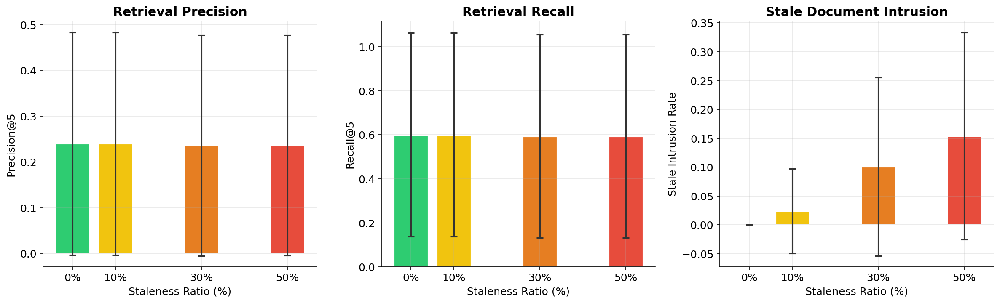
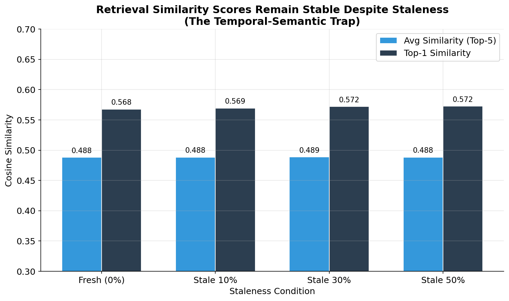
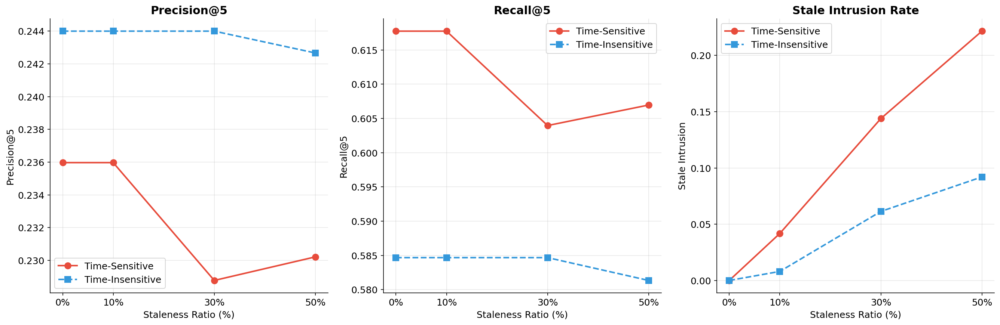
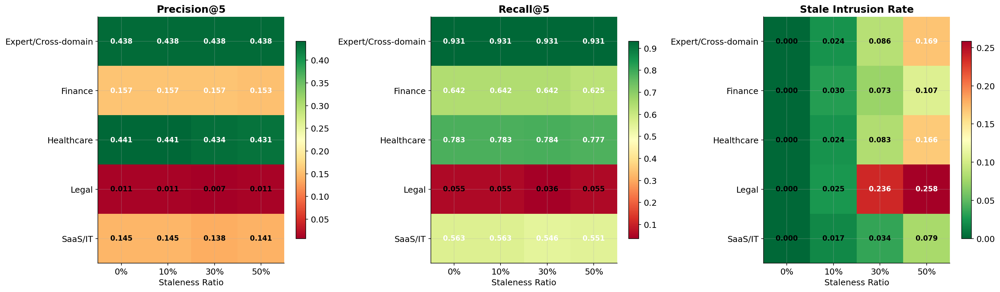
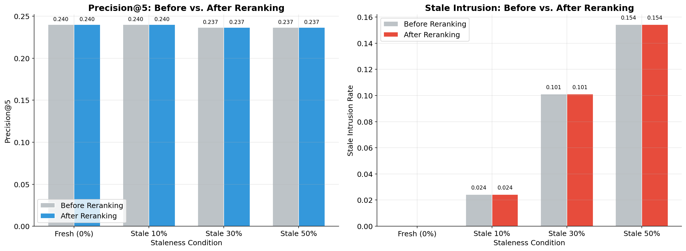
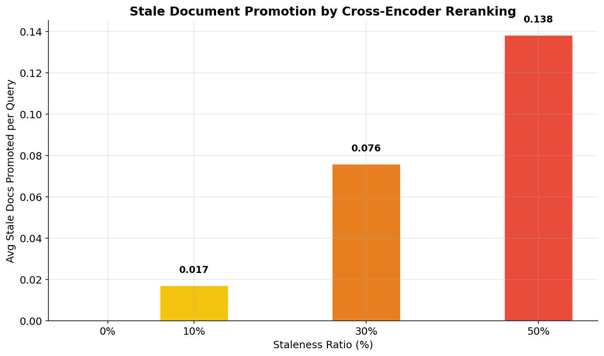
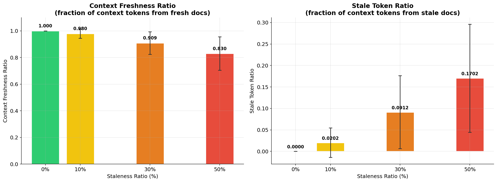
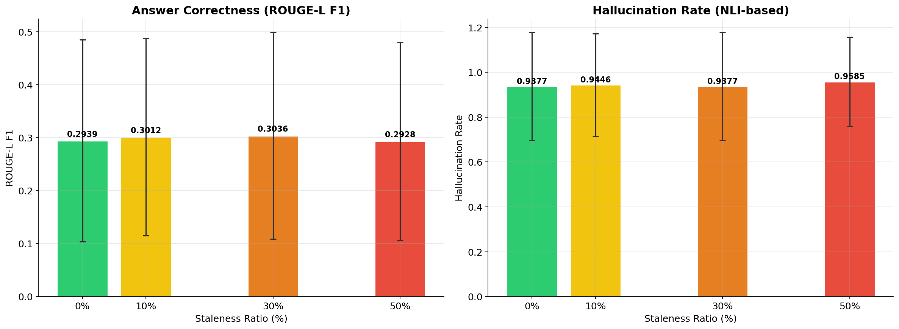
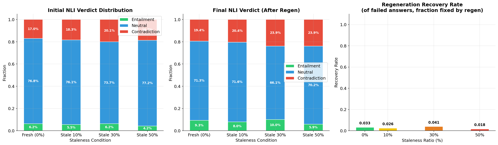

# FreshRAG: How Stale Content Degrades AI Search Pipelines

This repository contains the code and data for **FreshRAG**, a research project investigating how outdated ("stale") content in retrieval corpora silently degrades the performance of Retrieval-Augmented Generation (RAG) pipelines. We systematically inject controlled levels of staleness (10%, 30%, 50%) into enterprise-domain corpora and measure the cascading impact across all five stages of a production RAG pipeline: retrieval, reranking, context assembly, generation, and verification.

## Key Takeaways

- **Stale content is invisible to standard monitoring.** Embedding similarity scores, latency, and headline precision remain virtually unchanged even at 50% staleness — creating a *temporal-semantic trap* where systems appear healthy while silently serving outdated information.
- **Reranking cannot fix what retrieval lets in.** Cross-encoder rerankers fail to filter stale documents and actively promote them to higher ranks.
- **Fresh document displacement is the real harm.** At 50% staleness, 24.2% fewer fresh answer-bearing documents are retrieved per query — a degradation hidden by stable Precision@5 numbers.
- **Domain vulnerability varies dramatically.** Legal documents (CUAD) suffer the highest stale intrusion (25.8%), while expert/cross-domain queries maintain precision.
- **Verification is costly but insufficient.** With 93.8–95.8% of generated answers flagged as hallucinations, even regeneration recovers only 5.8–10.3% of failures.

---

## Experimental Setup

### Domains and Data

We build on the [RAGBench](https://huggingface.co/datasets/rungalileo/ragbench) dataset, sampling 289 queries across five enterprise domains:

| Domain | Description | Queries |
|--------|-------------|---------|
| **CovidQA** | Healthcare & COVID-19 | 58 |
| **CUAD** | Legal contract analysis | 55 |
| **ExpertQA** | Expert cross-domain | 58 |
| **FinQA** | Financial reasoning | 60 |
| **TechQA** | SaaS & IT support | 58 |

Each domain contains a balanced mix of **time-sensitive** and **time-insensitive** queries (30 each). The corpus comprises ~997 documents with ground-truth relevance labels.

### Staleness Conditions

We evaluate four corpus conditions, where staleness is introduced by replacing fresh documents with semantically similar but factually outdated variants generated via Gemini:

| Condition | Description |
|-----------|-------------|
| **Fresh (0%)** | Original corpus — no stale content |
| **Stale 10%** | 10% of documents replaced with stale variants |
| **Stale 30%** | 30% of documents replaced with stale variants |
| **Stale 50%** | 50% of documents replaced with stale variants |

### Models

| Purpose | Model |
|---------|-------|
| Embedding | `all-MiniLM-L6-v2` (sentence-transformers) |
| Retrieval | FAISS IndexFlatIP |
| Reranking | `cross-encoder/ms-marco-MiniLM-L6-v2` |
| NLI (assembly) | `cross-encoder/nli-MiniLM2-L6-H768` |
| NLI (verification) | `cross-encoder/nli-deberta-v3-base` |
| Generation | Gemini 2.5 Flash |

### Pipeline Architecture

```
Corpus Building → Stale Preparation → Retrieval → Reranking → Context Assembly → Generation → Verification
   (Stage 1)        (Stage 2)         (Stage 3)   (Stage 3b)    (Stage 3c)      (Stage 4)    (Stage 5)
```

---

## How to Run

### Prerequisites

```bash
pip install sentence-transformers faiss-cpu numpy pandas matplotlib google-generativeai datasets requests tqdm
```

Set your Gemini API key:
```bash
export GOOGLE_API_KEY="your-key-here"
```

### Execution Order

All scripts are run from the **repository root**. Each stage depends on the previous stage's output.

```bash
# Stage 1: Build corpus from RAGBench
jupyter notebook notebooks/ragbench.ipynb

# Stage 2: Generate stale corpus conditions
python scripts/stale_pipeline.py --step all
# Or run individually: --step prep → --step generate → --step build

# Stage 3: Retrieval evaluation
python scripts/retrieval_eval.py --corpus_dir ./freshrag_experiment --k 5

# Stage 3b: Reranking evaluation
python scripts/rerank_eval.py --corpus_dir ./freshrag_experiment --k 5

# Stage 3c: Context assembly (produces generation_payloads.jsonl for Stage 4)
python scripts/context_assembly_eval.py --corpus_dir ./freshrag_experiment --k 5

# Stage 4: LLM answer generation
python scripts/generation_eval.py --corpus_dir ./freshrag_experiment --model gemini-2.5-flash

# Stage 5: Verification and regeneration
python scripts/verification_eval.py --corpus_dir ./freshrag_experiment --max_regen_attempts 1
```

### Analysis Notebooks

After each stage completes, run the corresponding analysis notebook in `notebooks/` to generate figures and summary tables.

---

## Results and Findings

### Stage 3 — Retrieval: The Temporal-Semantic Trap

| Condition | Precision@5 | Recall@5 | Stale Intrusion | Fresh AB Docs |
|-----------|:-----------:|:--------:|:---------------:|:-------------:|
| Fresh (0%) | 0.240 | 0.601 | 0.000 | 1.20 |
| Stale 10% | 0.240 | 0.601 | 0.024 | 1.14 |
| Stale 30% | 0.237 | 0.594 | 0.101 | 1.03 |
| Stale 50% | 0.237 | 0.594 | 0.154 | 0.91 |

Headline metrics (Precision, Recall) decline by only ~1.4%, masking the real damage: a **24.2% drop in fresh answer-bearing documents** retrieved per query. Stale documents intrude silently because embedding similarity scores remain virtually unchanged across staleness levels (~0.488 ± 0.0005).

<p align="center">
  
</p>
<p align="center"><em><strong>Figure 1.</strong> Retrieval degradation across staleness conditions. Precision and Recall show minimal headline decline, while Stale Intrusion Rate climbs steadily and Fresh Answer-Bearing document retrieval drops by 24.2% — revealing the hidden cost of corpus staleness.</em></p>

<p align="center">
  
</p>
<p align="center"><em><strong>Figure 2.</strong> The Temporal-Semantic Trap. Cosine similarity scores remain virtually identical across all staleness conditions, demonstrating that dense embedding models cannot distinguish stale from fresh content — stale documents are semantically indistinguishable from their fresh counterparts.</em></p>

### Time-Sensitive vs. Time-Insensitive Queries

Time-sensitive queries are disproportionately affected: their fresh document retrieval drops by **50.6%** (1.18 → 0.58) at 50% staleness, compared to a smaller decline for time-insensitive queries. Notably, stale content also causes **indirect contamination** — time-insensitive queries still suffer 9.2% stale intrusion at 50% staleness despite not being direct targets.

<p align="center">
  
</p>
<p align="center"><em><strong>Figure 3.</strong> Time-sensitive queries suffer disproportionate degradation. They experience 2× the stale intrusion rate (22.2% vs. 9.2%) and lose over half their fresh answer-bearing documents at 50% staleness, while time-insensitive queries are still indirectly contaminated.</em></p>

### Domain Vulnerability

<p align="center">
  
</p>
<p align="center"><em><strong>Figure 4.</strong> Domain-level retrieval performance heatmap. Legal documents (CUAD) are most vulnerable with the highest stale intrusion rate (25.8%), likely due to dense, formulaic language that produces near-identical embeddings. Expert/cross-domain queries maintain precision throughout.</em></p>

### Stage 3b — Reranking: Amplifying the Problem

| Condition | Precision (before) | Precision (after) | Stale Intrusion (before) | Stale Intrusion (after) |
|-----------|:------------------:|:-----------------:|:------------------------:|:-----------------------:|
| Fresh (0%) | 0.240 | 0.240 | 0.000 | 0.000 |
| Stale 10% | 0.240 | 0.240 | 0.024 | 0.024 |
| Stale 30% | 0.237 | 0.237 | 0.101 | 0.101 |
| Stale 50% | 0.237 | 0.237 | 0.154 | 0.154 |

The cross-encoder reranker **completely fails to mitigate staleness**. Precision and stale intrusion are identical before and after reranking across all conditions. Worse, the reranker actively promotes stale documents to higher ranks as staleness increases.

<p align="center">
  
</p>
<p align="center"><em><strong>Figure 5.</strong> Precision and Stale Intrusion before vs. after reranking. The cross-encoder reranker produces no change in either metric — it falls into the same temporal-semantic trap as the retriever, unable to distinguish stale from fresh content.</em></p>

<p align="center">
  
</p>
<p align="center"><em><strong>Figure 6.</strong> Stale document promotion by the reranker. As corpus staleness increases, the cross-encoder increasingly promotes stale documents to higher ranks (0.017 → 0.138 promoted docs/query), actively worsening the problem rather than mitigating it.</em></p>

### Stage 3c — Context Assembly: Contaminated Context

| Condition | Contradiction Density | Context Freshness | Stale Token Ratio | Num Chunks |
|-----------|:---------------------:|:-----------------:|:-----------------:|:----------:|
| Fresh (0%) | 0.188 | 100.0% | 0.0% | 17.1 |
| Stale 10% | 0.185 | 98.0% | 2.0% | 17.4 |
| Stale 30% | 0.138 | 90.9% | 9.1% | 18.8 |
| Stale 50% | 0.126 | 83.0% | 17.0% | 19.8 |

Context freshness degrades linearly to 83% at 50% staleness, with stale tokens comprising 17% of assembled context. Paradoxically, detected contradiction density *decreases* — stale content does not overtly contradict fresh content, making it harder for NLI-based filters to catch.

<p align="center">
  
</p>
<p align="center"><em><strong>Figure 7.</strong> Context Freshness Ratio and Stale Token Ratio across staleness conditions. Freshness declines linearly while stale token contamination grows proportionally, directly polluting the context window that the LLM uses for answer generation.</em></p>

### Stage 4 — Generation: High Hallucination Across the Board

| Condition | Answer Correctness | Hallucination Rate | Cost/Query |
|-----------|:------------------:|:------------------:|:----------:|
| Fresh (0%) | 0.294 | 93.8% | $0.00053 |
| Stale 10% | 0.301 | 94.5% | $0.00053 |
| Stale 30% | 0.304 | 93.8% | $0.00053 |
| Stale 50% | 0.293 | 95.8% | $0.00053 |

Hallucination rates are extremely high (93.8–95.8%) across all conditions, indicating that the LLM frequently generates claims not entailed by the provided context. Answer correctness (ROUGE-L) shows negligible variation, and generation cost/latency remain stable — staleness has no impact on operational costs at this stage.

<p align="center">
  
</p>
<p align="center"><em><strong>Figure 8.</strong> Answer quality metrics across staleness conditions. Answer correctness (ROUGE-L) remains flat while hallucination rates stay persistently above 93%, indicating that the LLM's tendency to generate unsupported claims is a systemic issue exacerbated — but not solely caused — by stale content.</em></p>

### Stage 5 — Verification: Costly Recovery with Limited Success

| Condition | Failure Rate | Regen Trigger | Entailed After Regen | Total Cost/Query |
|-----------|:------------:|:-------------:|:--------------------:|:----------------:|
| Fresh (0%) | 93.8% | 93.8% | 9.3% | $0.00145 |
| Stale 10% | 94.5% | 94.5% | 8.0% | $0.00152 |
| Stale 30% | 93.8% | 93.8% | 10.0% | $0.00150 |
| Stale 50% | 95.8% | 95.8% | 5.9% | $0.00153 |

Verification triggers regeneration for nearly all answers, but only 5.9–10.0% are successfully recovered. The verification + regeneration pipeline roughly **triples the per-query cost** compared to generation alone (from ~$0.0005 to ~$0.0015), with regeneration accounting for ~65% of total cost.

<p align="center">
  
</p>
<p align="center"><em><strong>Figure 9.</strong> Entailment failure and recovery rates. Nearly all generated answers fail entailment checking (93.8–95.8%), triggering costly regeneration. Recovery success is marginal (5.9–10.0%), and worsens at 50% staleness — suggesting that stale-contaminated context fundamentally limits answer quality regardless of retry attempts.</em></p>

---

## Summary of Findings

### The Dual Invisibility Problem

Staleness degrades pipeline quality while remaining invisible to all standard monitoring signals:

| Signal | Affected by Staleness? |
|--------|:----------------------:|
| Retrieval latency | No (11–18ms, stable) |
| Embedding similarity scores | No (~0.488, stable) |
| Precision@5 / Recall@5 | Barely (−1.4%) |
| Reranker ambiguity scores | No (3.11–3.15, stable) |
| Generation cost / latency | No ($0.00053, stable) |
| **Fresh document displacement** | **Yes (−24.2%)** |
| **Stale intrusion rate** | **Yes (0% → 15.4%)** |
| **Context freshness** | **Yes (100% → 83%)** |

### Cascading Failure Across Pipeline Stages

Once stale content passes retrieval, no downstream component can compensate:

1. **Retrieval** lets stale documents in (similarity scores are indistinguishable)
2. **Reranking** fails to filter them out (and promotes them higher)
3. **Context assembly** packages stale tokens into the LLM prompt
4. **Generation** produces hallucinated answers from contaminated context
5. **Verification** catches failures but cannot cost-effectively recover

### Implications

- **Freshness-aware retrieval is needed.** Standard embedding + reranking pipelines have no temporal awareness. Explicit freshness signals (timestamps, decay functions) should be integrated at the retrieval stage.
- **Headline metrics are insufficient.** Precision@5 and Recall@5 mask real degradation. Pipelines should monitor stale intrusion rate, fresh document displacement, and context freshness ratio.
- **Verification alone is not a solution.** With 93%+ failure rates and low recovery, post-hoc verification is too expensive and too ineffective to compensate for upstream contamination. Prevention at retrieval is far cheaper than cure at verification.

---

## Repository Structure

```
data/                     # Source data (queries.jsonl, corpus.jsonl)
scripts/                  # Pipeline scripts (run from repo root)
  stale_pipeline.py        # Stage 2: stale corpus preparation
  retrieval_eval.py        # Stage 3: FAISS retrieval evaluation
  rerank_eval.py           # Stage 3b: cross-encoder reranking
  context_assembly_eval.py # Stage 3c: context assembly with NLI
  generation_eval.py       # Stage 4: LLM answer generation
  verification_eval.py     # Stage 5: NLI verification & regeneration
notebooks/                # Jupyter analysis notebooks
freshrag_experiment/      # Generated experiment data & results
figures/                  # Output plots (42 figures across all stages)
results/                  # Summary CSV tables
```

---

## Citation

If you use this work, please cite:

```
FreshRAG: Measuring the Impact of Stale Content on AI Search Pipeline Performance
```
